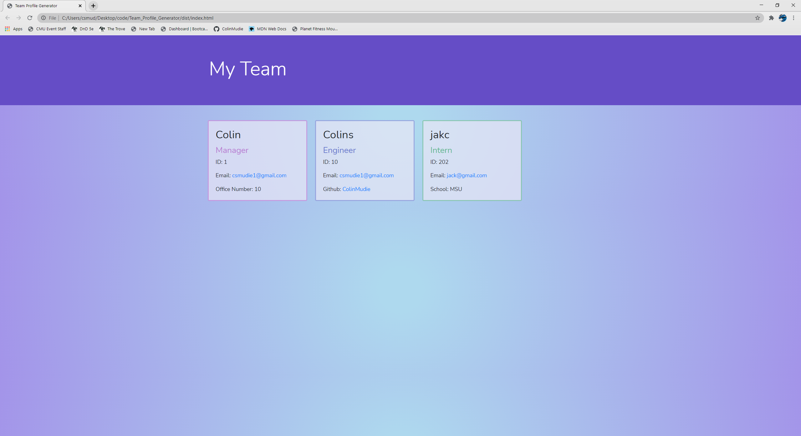

# Team Profile Generator


## Description
This program is designed as a way to easily enter information for a manager's employment team. Using the terminal in node.js, the information on each of the employees is gathered with the help from the npm "inquirer". This data is then compiled into an HTML5 file titled "index.html" and is saved inside the [dist](./dist) folder.

## Table of Contents

* [User Story](#user-story)
* [Installation](#installation)
* [Usage](#usage)
* [Features](#features)
* [Tests](#tests)
* [Questions](#questions)
* [License](#license)

## User Story
```md
AS A manager
I WANT to generate a webpage that displays my team's basic information
SO THAT I have quick access to their emails and GitHub profiles
```

## Installation
- Install [node.js](https://nodejs.org/en/) if you do not already have it.
- in the command terminal type in "npm install"
- you are now ready to run the program!

## Usage
- After the user successfully downloading the prerequisites in the [Installation](#installation) secion, start the program by entering "node index.js" in our terminal
- The user will then be presented with a serious of questions about an employee, with the last question being "Do you have another employee to add?". 
    - Upon answering yes, the User will be sent back to the firsdt question to enter information for another employee.
    - Upon answering no, the program will end and an index.html file will be created in the [dist](./dist) folder.
- Walkthrough Example:  

- Finished HTML File:  


## Features
- [node.js](https://nodejs.org/en/)
- [Inquirer](https://www.npmjs.com/package/inquirer)
- HTML5
- CSS
- [Jest](https://jestjs.io/) (test suite)

## Tests
Jest is the test suite that was used for this program.  
Instructions to download and use Jest:
- Install jest by entering "npm install --save-dev jest" into the terminal.
- Run the test by entering "npm test -- --verbose" into the terminal.
- There are 4 test suites:
    - [Employee Class](./test/employee.test.js)
        - Initialization:
            - should create an object with name, id, and email, if provided valid arguments
            - should throw an error if provided no arguments
            - should throw an error if 'name' is not a string 
            - should throw an error if 'name' contains a number 
            - should throw an error if 'id' is not an integer 
            - should throw an error if 'id' is a negative integer
            - should throw an error if 'email' is not a string 
            - should throw an error if 'email' is not a valid email address
        - getName fucntion:
            - should return the objects "name"
        - getId function:
            - should return the objects "id"
        - getEmail function:
            - should return the objects "email"
        - getRole function:
            - should return the objects role as "Employee"

    - [Manager Class](./test/manager.test.js) (extension of Employee)
        - Initialization:
            - should create an object with name, id, email, and officeNumber if provided valid arguments 
            - should throw an error if provided no arguments 
            - should throw an error if 'officeNumber' is not an Integer
            - should throw an error if 'officeNumber' is less than or equal to 0. 
        - getRole function:
            - should return the objects role as "Manager"
        - getOfficeNumber function:
            - should return the objects "officeNumber"

    - [Engineer Class](./test/engineer.test.js) (extension of Employee)
        - Initialization
            - should create an object with name, id, email, and github if provided valid arguments
            - should throw an error if provided no arguments 
            - should throw an error if 'github' is not a string 
        - getRole function:
            - should return the objects role as Engineer
        - getGithub function:
            - should return the objects "github" 

    - [Intern Class](./test/intern.test.js) (extension of Employee)
        - Initialization
            - Should create an object with name, id, email, and school if provided valid arguments
            - should throw an error if provided no arguments 
            - should throw an error if 'school' is not a string
        - getRole function:
            -  should return the objects role as Intern
        - getSchool function:
            -  should return the objects "school"  
- Example Jest Test:


## Questions
Github: [ColinMudie](https://github.com/ColinMudie/)  
Email: [csmudie1@gmail.com](csmudie1@gmail.com)


## License
MIT License
Copyright (c) [2021] [Colin Mudie]

Permission is hereby granted, free of charge, to any person obtaining a copy
of this software and associated documentation files (the "Software"), to deal
in the Software without restriction, including without limitation the rights
to use, copy, modify, merge, publish, distribute, sublicense, and/or sell
copies of the Software, and to permit persons to whom the Software is
furnished to do so, subject to the following conditions:

The above copyright notice and this permission notice shall be included in all
copies or substantial portions of the Software.

THE SOFTWARE IS PROVIDED "AS IS", WITHOUT WARRANTY OF ANY KIND, EXPRESS OR
IMPLIED, INCLUDING BUT NOT LIMITED TO THE WARRANTIES OF MERCHANTABILITY,
FITNESS FOR A PARTICULAR PURPOSE AND NONINFRINGEMENT. IN NO EVENT SHALL THE
AUTHORS OR COPYRIGHT HOLDERS BE LIABLE FOR ANY CLAIM, DAMAGES OR OTHER
LIABILITY, WHETHER IN AN ACTION OF CONTRACT, TORT OR OTHERWISE, ARISING FROM,
OUT OF OR IN CONNECTION WITH THE SOFTWARE OR THE USE OR OTHER DEALINGS IN THE
SOFTWARE.
